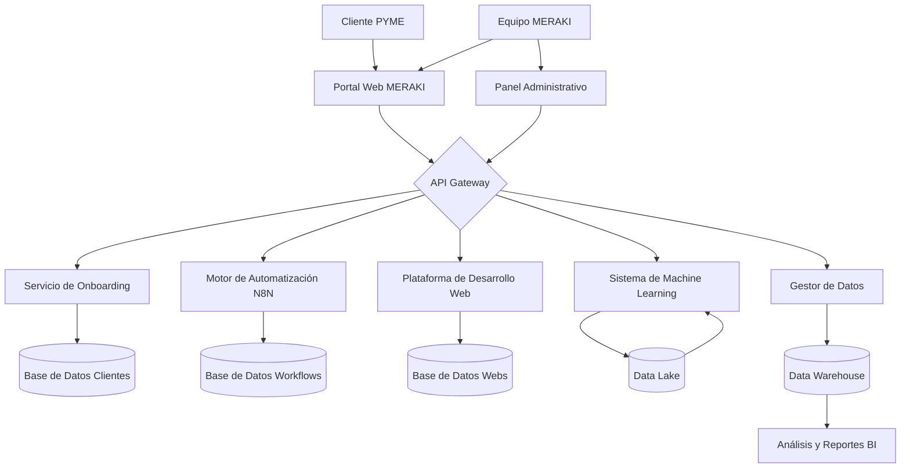
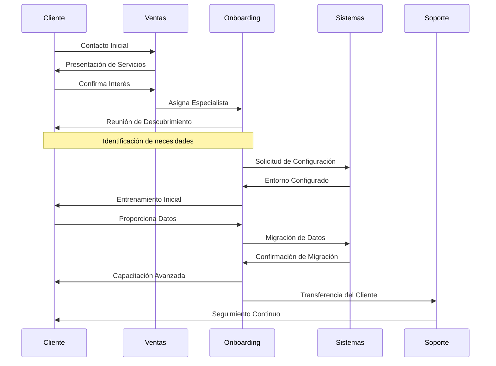
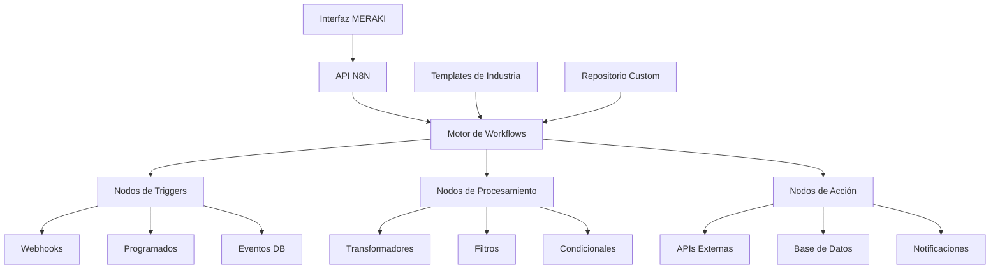
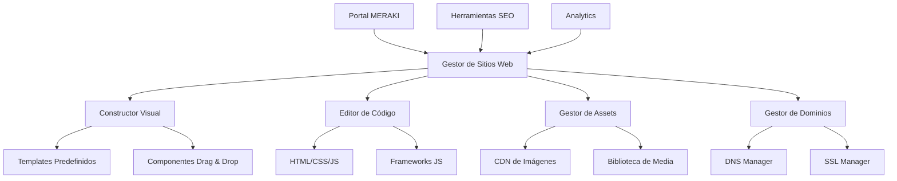
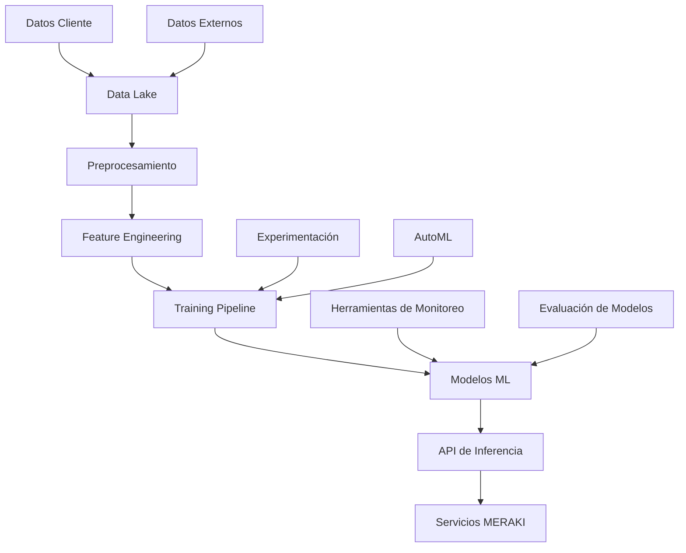
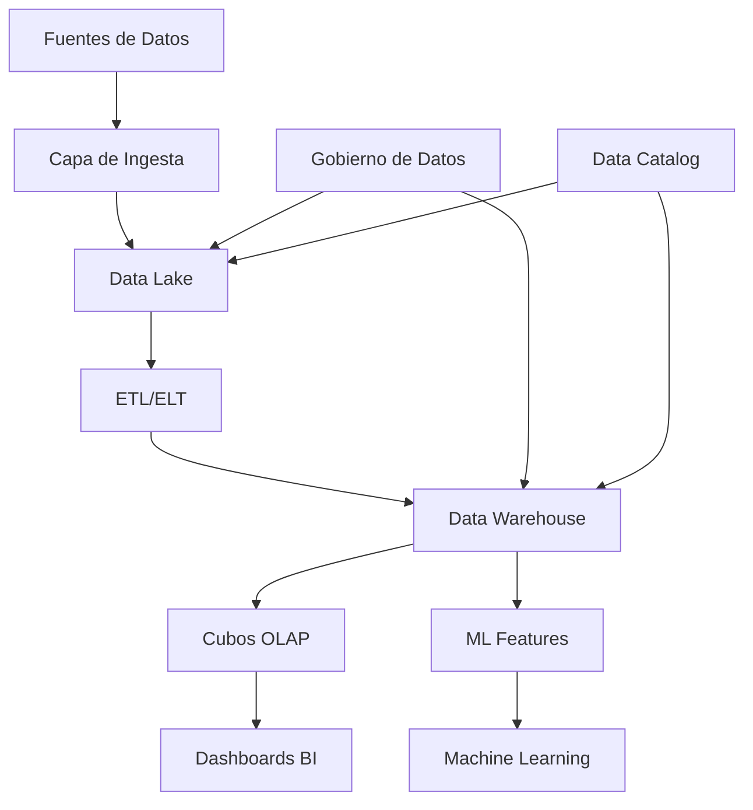
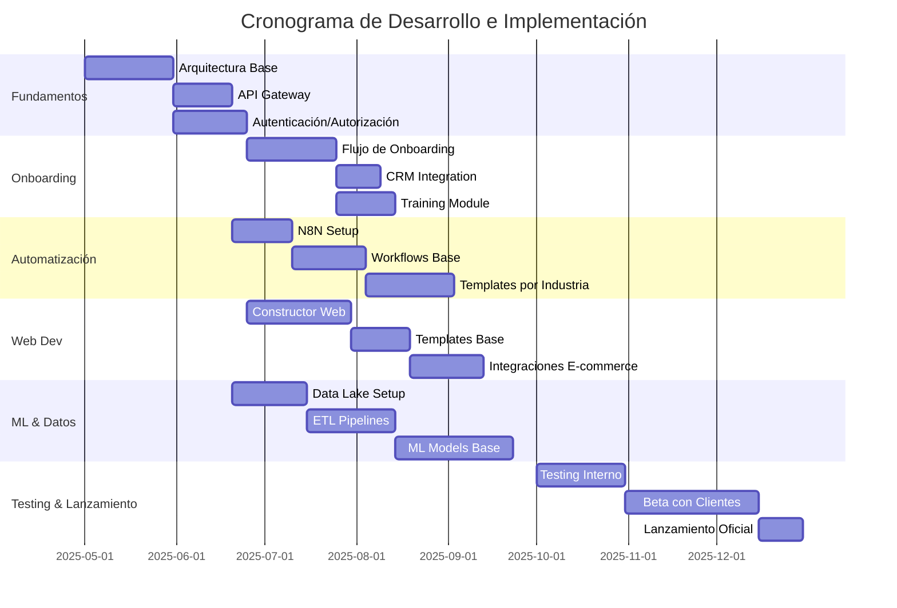
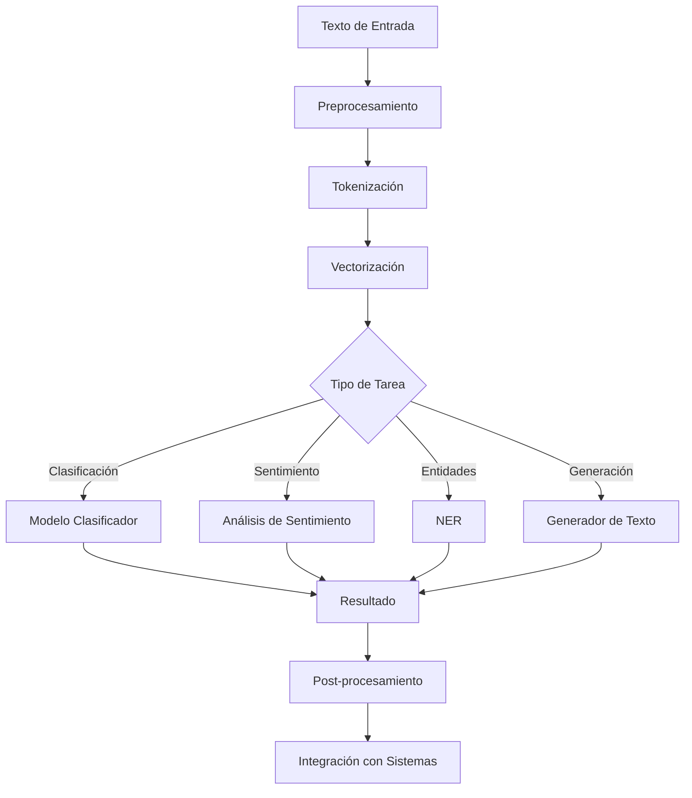

# Sistema de Creación y Planificación para MERAKI Technology

## Índice
1. [Arquitectura General del Sistema](#1-arquitectura-general-del-sistema)
2. [Stack Tecnológico](#2-stack-tecnológico)
3. [Flujo de Onboarding de Clientes](#3-flujo-de-onboarding-de-clientes)
4. [Sistema de Automatización con N8N](#4-sistema-de-automatización-con-n8n)
5. [Desarrollo Web e Integraciones](#5-desarrollo-web-e-integraciones)
6. [Infraestructura de Machine Learning](#6-infraestructura-de-machine-learning)
7. [Manejo y Procesamiento de Datos](#7-manejo-y-procesamiento-de-datos)
8. [Plan de Implementación](#8-plan-de-implementación)
9. [Métricas y KPIs](#9-métricas-y-kpis)
10. [Documentación Técnica](#10-documentación-técnica)

## 1. Arquitectura General del Sistema

La arquitectura del sistema MERAKI está diseñada como una plataforma modular, escalable y orientada a servicios, permitiendo a las PYMES digitalizar y automatizar sus operaciones de manera eficiente.

### Diagrama de Arquitectura

### Componentes Principales

1. **Portal Web MERAKI**: Interfaz principal para clientes y administradores
2. **API Gateway**: Gestiona todas las comunicaciones entre servicios
3. **Servicio de Onboarding**: Maneja el proceso de incorporación de nuevos clientes
4. **Motor de Automatización N8N**: Gestiona flujos de trabajo automatizados
5. **Plataforma de Desarrollo Web**: Herramientas para crear sitios web y aplicaciones
6. **Sistema de Machine Learning**: Proporciona capacidades de análisis predictivo e inteligencia
7. **Gestor de Datos**: Administra el almacenamiento y procesamiento de datos

## 2. Stack Tecnológico

### Frontend
- **Framework**: React.js / Next.js
- **UI/UX**: Material-UI y Tailwind CSS
- **Estado**: Redux / React Context API
- **Visualización de datos**: D3.js / Chart.js

### Backend
- **API**: Node.js con Express o NestJS
- **Autenticación**: OAuth 2.0 / JWT
- **Documentación API**: Swagger / OpenAPI

### Base de Datos
- **Relacional**: PostgreSQL
- **NoSQL**: MongoDB
- **Cache**: Redis
- **Búsqueda**: Elasticsearch

### Infraestructura
- **Cloud**: AWS / Google Cloud Platform
- **Contenedores**: Docker / Kubernetes
- **CI/CD**: GitHub Actions / Jenkins
- **Monitoreo**: Prometheus / Grafana

### Lenguajes de Programación
| Componente | Lenguajes Principales | Lenguajes Secundarios |
|------------|----------------------|----------------------|
| Frontend | JavaScript/TypeScript | HTML5, CSS3 |
| Backend | Node.js, Python | Go, Java |
| Machine Learning | Python | R, Julia |
| Automatización | JavaScript (N8N) | Python |
| Móvil | React Native | Swift, Kotlin |

## 3. Flujo de Onboarding de Clientes

El proceso de onboarding está diseñado para garantizar una incorporación eficiente de nuevos clientes al ecosistema MERAKI.

### Diagrama de Flujo de Onboarding

### Etapas del Proceso

1. **Contacto y Evaluación Inicial**
   - Reunión introductoria y presentación de servicios
   - Evaluación inicial de necesidades del cliente
   - Propuesta personalizada de servicios

2. **Configuración y Preparación**
   - Creación de cuenta y accesos
   - Configuración inicial de entorno
   - Preparación de integraciones

3. **Implementación y Migración**
   - Transferencia de datos existentes
   - Configuración de flujos de trabajo
   - Personalización de interfaces

4. **Capacitación y Adopción**
   - Entrenamiento a usuarios clave
   - Documentación personalizada
   - Acompañamiento en primeros usos

5. **Seguimiento y Optimización**
   - Monitoreo de uso
   - Ajustes según retroalimentación
   - Expansión de funcionalidades

## 4. Sistema de Automatización con N8N

La plataforma utiliza N8N como motor de automatización para crear flujos de trabajo eficientes para las PYMES.

### Diagrama de Arquitectura N8N

### Flujos de Trabajo Automatizados

1. **Gestión de Ventas**
   - Seguimiento de leads
   - Automatización de emails de seguimiento
   - Actualización de CRM

2. **Gestión de Inventario**
   - Alertas de stock bajo
   - Órdenes automáticas de reposición
   - Sincronización multi-canal

3. **Atención al Cliente**
   - Tickets de soporte automatizados
   - Enrutamiento inteligente
   - Respuestas predefinidas

4. **Finanzas**
   - Facturación automática
   - Seguimiento de pagos
   - Reportes periódicos

### Integración con Sistemas Externos

- CRM (HubSpot, Salesforce)
- ERP (SAP, Odoo)
- Comercio Electrónico (Shopify, WooCommerce)
- Comunicación (Slack, Teams, Email)

## 5. Desarrollo Web e Integraciones

El sistema ofrece capacidad para crear y gestionar presencia web para los clientes.

### Diagrama de Arquitectura Web

### Capacidades de Desarrollo Web

- **Sitios Web Corporativos**
  - Templates responsivos por industria
  - Integración con CMS headless
  - Optimización SEO automática

- **E-commerce**
  - Catálogo de productos
  - Pasarelas de pago
  - Gestión de inventario

- **Aplicaciones Web Personalizadas**
  - Formularios dinámicos
  - Áreas de clientes
  - Dashboards interactivos

### Integraciones API

| Categoría | Integraciones Disponibles |
|-----------|--------------------------|
| Pagos | Stripe, PayPal, Mercado Pago |
| Logística | DHL, FedEx, Correos locales |
| Marketing | Google Analytics, Facebook Pixel |
| Comunicación | Twilio, SendGrid, WhatsApp Business |

## 6. Infraestructura de Machine Learning

El sistema incorpora capacidades de machine learning para ofrecer inteligencia y automatización avanzada.

### Diagrama de Arquitectura ML

### Tecnologías ML Implementadas

| Tipo | Tecnologías | Casos de Uso |
|------|-------------|--------------|
| Frameworks | TensorFlow, PyTorch, Scikit-learn | Desarrollo de modelos |
| Procesamiento | Apache Spark, Pandas, Dask | Manejo de datos a escala |
| Deployment | MLflow, KubeFlow, BentoML | Gestión del ciclo de vida |
| AutoML | H2O.ai, AutoGluon | Optimización automática |

### Casos de Uso ML por Industria

1. **Retail**
   - Predicción de demanda
   - Recomendaciones de productos
   - Optimización de precios

2. **Servicios**
   - Predicción de abandono de clientes
   - Segmentación avanzada
   - Optimización de rutas

3. **Manufactura**
   - Mantenimiento predictivo
   - Control de calidad
   - Optimización de procesos

4. **Finanzas**
   - Detección de fraude
   - Scoring de crédito
   - Análisis de riesgos

## 7. Manejo y Procesamiento de Datos

El sistema implementa una arquitectura robusta para la gestión y análisis de datos.

### Diagrama de Flujo de Datos

### Tecnologías de Datos

| Capa | Tecnologías | Propósito |
|------|-------------|-----------|
| Ingesta | Kafka, Airbyte, NiFi | Captura de datos en tiempo real y batch |
| Almacenamiento | S3/GCS, PostgreSQL, MongoDB | Almacenamiento estructurado y no estructurado |
| Procesamiento | Spark, Airflow, dbt | Transformación y modelado |
| Análisis | PowerBI, Tableau, Looker | Visualización y reportes |

### Estrategia de Manejo de Datos

1. **Ingesta de Datos**
   - Conectores pre-construidos para sistemas comunes
   - Webhooks para integraciones personalizadas
   - Captura de eventos en tiempo real

2. **Procesamiento**
   - Pipelines de datos automatizados
   - Transformaciones para modelos específicos de industria
   - Agregaciones pre-calculadas para reportes comunes

3. **Modelado de Datos**
   - Esquemas dimensionales para análisis
   - Datos tabulares para ML
   - Grafos para relaciones complejas

4. **Gobierno y Seguridad**
   - Políticas de retención y purga
   - Enmascaramiento de datos sensibles
   - Trazabilidad y auditoría

## 8. Plan de Implementación

### Cronograma de Desarrollo e Implementación

### Etapas de Implementación

1. **Fase 1: MVP (3 meses)**
   - Funcionalidades core de onboarding
   - Automatizaciones básicas con N8N
   - Templates web esenciales
   - Infraestructura base de datos

2. **Fase 2: Expansión (3 meses)**
   - Automatizaciones avanzadas
   - Integración con sistemas externos
   - Constructor web completo
   - Análisis de datos básico

3. **Fase 3: ML y Análisis Avanzado (4 meses)**
   - Modelos ML iniciales
   - Dashboards analíticos
   - Optimización de rendimiento
   - Escalabilidad

4. **Fase 4: Refinamiento y Escalado (2 meses)**
   - Optimización global
   - Estrategia de ventas y marketing
   - Expansión de equipos
   - Lanzamiento completo al mercado

## 9. Métricas y KPIs

### Métricas de Producto

| Categoría | Métricas | Objetivo |
|-----------|----------|----------|
| Adopción | Usuarios activos mensuales | >80% de clientes |
| Engagement | Tiempo promedio por sesión | >30 minutos |
| Satisfacción | NPS | >50 |
| Técnicas | Tiempo de respuesta | <200ms |
| Estabilidad | Uptime | >99.9% |

### KPIs de Negocio

1. **Crecimiento**
   - Nuevos clientes por mes
   - Tasa de conversión de prueba a pago
   - Customer Lifetime Value (CLTV)

2. **Retención**
   - Churn mensual
   - Expansión de uso de productos
   - Renovaciones anticipadas

3. **Eficiencia Operativa**
   - Costo de adquisición de cliente (CAC)
   - Tiempo de onboarding
   - Tickets de soporte por cliente

## 10. Documentación Técnica

### Estándares de Codificación

- **Frontend**: Airbnb JavaScript Style Guide
- **Backend**: Google Python Style Guide
- **Documentación**: JSDoc/Sphinx
- **Control de Versiones**: Git Flow

### Arquitectura de API

- RESTful API con OpenAPI/Swagger
- Autenticación OAuth2 con JWT
- Limitación de tasa y cuotas por cliente
- Versioning mediante URI (/v1/, /v2/)

### Seguridad

- Encriptación en tránsito (TLS 1.3)
- Encriptación en reposo (AES-256)
- OWASP Top 10 compliance
- Pentest trimestral

### Infraestructura

- Multi-tenant architecture
- Despliegue por regiones (LATAM, NA, EU)
- Estrategia de respaldo y recuperación
- Monitoreo 24/7 y alertas

---

# Apéndice: Especificaciones de Machine Learning

## A. Modelos ML por Etapa

### Fase 1: Análisis Predictivo Básico

| Modelo | Algoritmo | Caso de Uso |
|--------|-----------|-------------|
| Previsión de Ventas | ARIMA/Prophet | Proyección a 30/60/90 días |
| Segmentación de Clientes | K-Means | Marketing personalizado |
| Detección de Anomalías | Isolation Forest | Alerta de fraudes |

### Fase 2: Modelos Avanzados

| Modelo | Algoritmo | Caso de Uso |
|--------|-----------|-------------|
| Recomendaciones | Collaborative Filtering | Cross-selling |
| NLP para Tickets | BERT/RoBERTa | Clasificación automática |
| Predicción de Abandono | XGBoost | Retención proactiva |

### Fase 3: ML Personalizado por Industria

| Industria | Modelo | Caso de Uso |
|-----------|--------|-------------|
| Retail | Demand Forecasting | Gestión de inventario |
| Servicios | Optimización de Rutas | Logística eficiente |
| Finanzas | Credit Scoring | Evaluación de riesgos |

## B. Procesamiento de Lenguaje Natural (NLP)

La plataforma implementa varios modelos NLP para interpretar y procesar texto:

1. **Análisis de Sentimiento**
   - Monitoreo de feedback de clientes
   - Evaluación de comentarios en redes sociales
   - Calificación de satisfacción en tickets

2. **Extracción de Entidades**
   - Identificación de productos en conversaciones
   - Reconocimiento de nombres y organizaciones
   - Detección de ubicaciones y fechas

3. **Clasificación de Documentos**
   - Categorización automática de emails
   - Clasificación de tickets de soporte
   - Organización de documentación

4. **Generación de Texto**
   - Respuestas automáticas a consultas frecuentes
   - Generación de informes periódicos
   - Creación de descripciones de productos

### Flujo de Procesamiento NLP

## C. Visión Artificial

La plataforma incluye capacidades de visión artificial para casos específicos:

1. **Reconocimiento de Documentos**
   - Extracción de datos de facturas
   - Procesamiento de albaranes
   - Digitalización de formularios

2. **Control de Calidad**
   - Detección de defectos en productos
   - Verificación de empaquetado
   - Control de procesos industriales

3. **Análisis de Imágenes de Retail**
   - Análisis de disposición de productos
   - Monitoreo de stock en estanterías
   - Mapas de calor de tráfico de clientes
